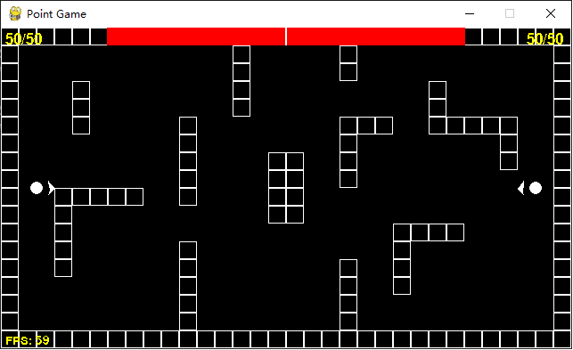

# Point-Game

## 简介
基于 [Python](https://www.python.org) 使用 [Pygame](https://www.pygame.org) 库编写的二维平面游戏  
**宗旨：打造一个简洁，好上手二维射击游戏**  

## 玩法
游戏界面(640x360, 默认是1280x720)  
  
每名玩家寿命100, 子弹伤害10, 把对方打死即可获胜  
目前只有2人模式  

键位:  
玩家1: W进, S退, A左转, D右转, J发射, K换弹  
玩家2: 方向键上进, 下退, 左转, 右转, 1发射, 2换弹  

## 依赖
[Python3](https://www.python.org) 和 [Pygame](https://www.pygame.org)  

安装 Pygame  
```shell
$ pip install pygame
```

## 运行
Windows
```shell
$ python main.py
```

Linux 或 MacOS
```shell
$ python3 main.py
```

## 计划
[Go To ToDo](./docs/ToDo.md)

## 鸣谢
[Go To Thanks](./docs/Thanks.md)
